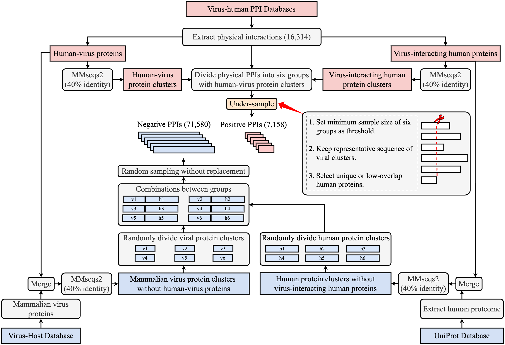

**Improved prediction of virus-human protein-protein interactions by incorporating network topology and viral molecular mimicry**

The protein-protein interactions (PPIs) between viruses and human play crucial roles in viral infections. Although numerous computational approaches have been proposed for predicting virus-human PPIs, their performance remains suboptimal and may be overestimated due to the lack of benchmark dataset. To address these limitations, we first constructed a carefully curated benchmark dataset, ensuring that the training and test sets contained non-overlapping PPI samples with low sequence similarity between viral and human proteins. Based on this dataset, we developed vhPPIpred, a machine learning-based prediction method that not only incorporated sequence and evolutionary information but also leveraged network topology and viral molecular mimicry of human PPIs. Comparative experiments demonstrated that vhPPIpred outperformed five state-of-the-art methods on both our benchmark dataset and three independent datasets, as well as the identification of potential human viral receptors. Further analysis revealed that vhPPIpred achieves high computational efficiency, requiring relatively low runtime and memory. In summary, this study provides a robust benchmark dataset and an effective tool for virus-human PPIs prediction, with potential applications in antiviral drug discovery and host-pathogen interaction research.


## Architecture of vhPPIpred


## Pipleline for dataset construction


## Requirements
```python
Python==3.8.19
pytorch==2.4.0
scikit-learn==1.3.2
xgboost==2.1.1
pandas==2.0.3
numpy==1.24.4
matplotlib==3.7.5
imbalanced-learn==0.12.3
biopython==1.83
jupyterlab==4.0.11
```


## Installation

```python
conda env create -f environment.yml

OR

conda create --name vhppipred python=3.8.19

pip install -r requirements.txt
```

## Preparation of features
### ProtT5 embedding
The ProtT5 embedding of viral or human protein was generated by ProtT5-XL-U50 (https://huggingface.co/Rostlab/prot_t5_xl_half_uniref50-enc), which could be run by `./script/run_pretrainedmodelProteinEncoder.py`

### PSSM embedding
The PSSM embedding of viral or human protein was generated by `./script/getPssmEmbed.py`. All viral and human proteins were searched against the UniRef90 database using PSI-BLAST (NCBI BLAST 2.12.0+) with three iterations (num_iteractions=3), generating PSSM for each protein. For each PSSM, we performed row-wise normalization followed by column-wise averaging, ultimately producing a vector of length 20 for each protein. This process could be achieved by `./script/psiblast_multicpu.py` & `./script/getPssmEmbed.py`

### Degree of human protein
The human protein degree was computed by `NetworkX`, which was stored in `./demo_dataset/VirusHumanSimiAndDegree/node_feat_human.tsv`

### Viral mimicry of human protein interactions
We computed similarity between virus proteins and neighbor proteins with `./script/step1_get_seqsimi_diamod.py` and integrated interaction scores between neighbor proteins and human protein with `./script/step2_sum_seqsimi_allhv_optimize.py`

## Benchmark dataset construction
```python
data_process.ipynb
```

## Training, validating and testing
```python
vhppipred_train_validate_test.ipynb
```

## Apply vhPPIpred to prediction
```python
## Take files in demo_dataset as an example.
python vhppipred_predict.py
```

## Reproduce figures in paper
```python
FigureForPaper.ipynb
```


